<div align="center">
<div>
<a href="https://github.com/LJHolyGround/OBIFormer"></a>
    <a href="https://github.com/LJHolyGround/OBIFormer"></a>
    <a href="https://arxiv.org/abs/2504.13524"></a>
    <a href="https://github.com/LJHolyGround/OBIFormer"></a>
</div>

<h1>OBIFormer: A Fast Attentive Denoising Framework for Oracle Bone Inscriptions 🪄</h1>

_A Fast Attentive Denoising Framework for Oracle Bone Inscriptions_

<div>
    <a href="https://cs.ecnu.edu.cn" target="_blank">Jinhao Li</a><sup>1*</sup>,
    <a href="https://scholar.google.com.hk/citations?hl=zh-CN&user=NSR4UkMAAAAJ" target="_blank">Zijian Chen</a><sup>2</sup>,
    <a href="https://shss.sjtu.edu.cn/Web/FacultyDetail/46?f=1&t=4" target="_blank">Tingzhu Chen</a><sup>3&dagger;</sup>,
    <a href="https://scholar.google.com.hk/citations?hl=zh-CN&user=E6zbSYgAAAAJ" target="_blank">Zhiji Liu</a><sup>4</sup>
    <a href="https://faculty.ecnu.edu.cn/_s16/wzb/main.psp" target="_blank">Changbo Wang</a><sup>1</sup>
</div>

<div>
  <sup>1</sup>School of Computer Science and Technology, East China Normal University
  <br>
  <sup>2</sup>Institute of Image Communication and Information Processing, Shanghai Jiao Tong University
  <br>
  <sup>3</sup>School of Humanities, Shanghai Jiao Tong University
  <br>
  <sup>4</sup>Center for the Study and Application of Chinese Characters, East China Normal University
  <br>
  <sup>&dagger;</sup>Corresponding author 
  <br>
  <br>
</div>   

<div style="width: 100%; text-align: center; margin:auto;">
      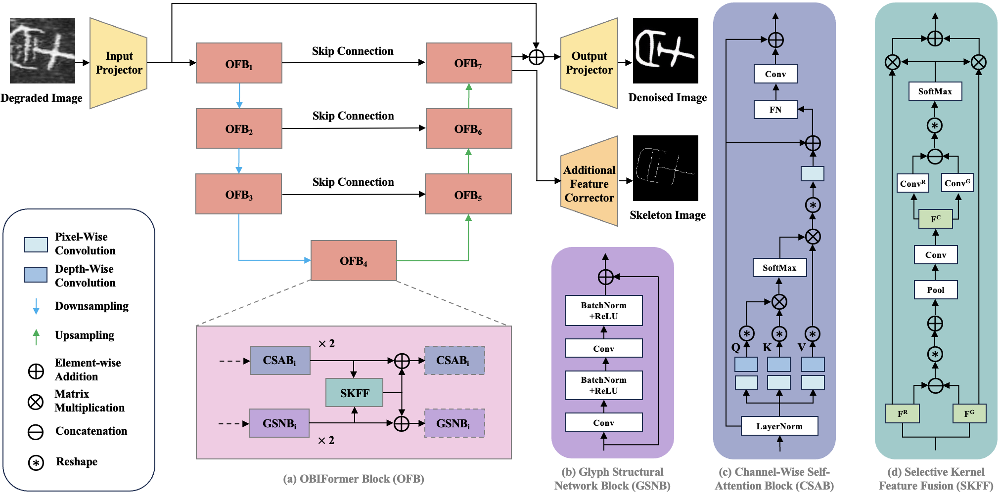
</div>
</div>
<br>

> The overall architecture of our **OBIFormer**. **(a)** OBIFormer block (OFB) that injects glyph information into the denoising backbone, **(b)** Glyph structural network block (GSNB) that extracts glyph features, **(c)** Channel-wise self-attention block (CSAB) that generates channel-wise self-attention effectively and efficiently, **(d)** Selective kernel feature fusion (SKFF) module that aggregates reconstruction features and glyph features.

## Release 🚀
- [2025/6/17] ⚡️ Pre-trained models are released !
- [2025/6/17] ⚡️ [Github repo](https://github.com/LJHolyGround/OBIFormer) for **OBIFormer** is online !

## Code 💻

Train the model from the scratch:

```
python train.py --train_input /path/to/input/of/train --train_target /path/to/target/of/train --val_input /path/to/input/of/val --val_target /path/to/target/of/val --store_path /path/to/results
```

Test a trained model:
```
python test.py --input_path /path/to/input --store_path /path/to/results --checkpoint /path/to/checkpoint
```

Checkpoints are available at the [pretrained](https://github.com/LJHolyGround/OBIFormer/tree/main/pretrained) folder.


## Motivations 💡

The previous OBI denoising methods either focus on pixel-level information or utilize vanilla transformers for glyph-based OBI denoising, which leads to tremendous computational overhead. Therefore, we proposed a fast attentive denoising framework for oracle bone inscriptions, i.e., **OBIFormer**. It leverages channel-wise self-attention, glyph extraction, and selective kernel feature fusion to reconstruct denoised images precisely while being computationally efficient. Our OBIFormer achieves state-of-the-art denoising performance for PSNR and SSIM metrics on synthetic and original OBI datasets. Furthermore, comprehensive experiments on a real oracle dataset demonstrate the great potential of our OBIFormer in assisting automatic OBI recognition.

<div style="width: 100%; text-align: center; margin:auto;">
      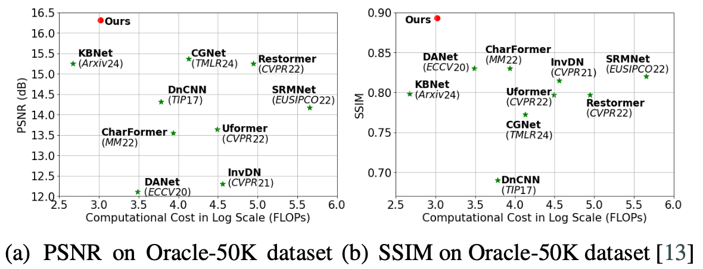
      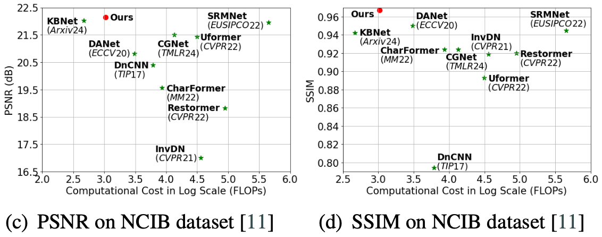
</div>

## Previous OBI Datasets 🗂️

We **summarize** and **examplify** the previous OBI datasets.

<details close>
<summary>Summary</summary>
<div style="width: 100%; text-align: center; margin:auto;">
      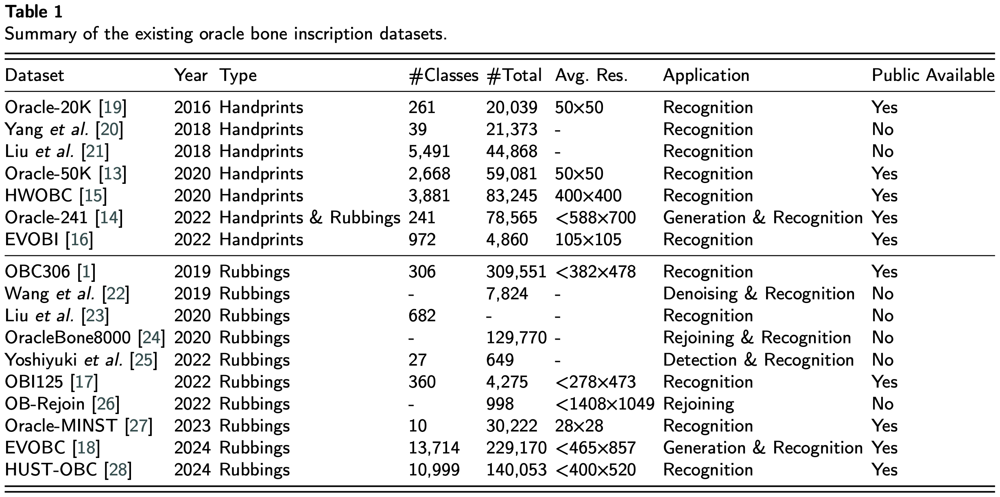
</div>
</details>

<details close>
<summary>Examples</summary>
<div style="width: 100%; text-align: center; margin:auto;">
      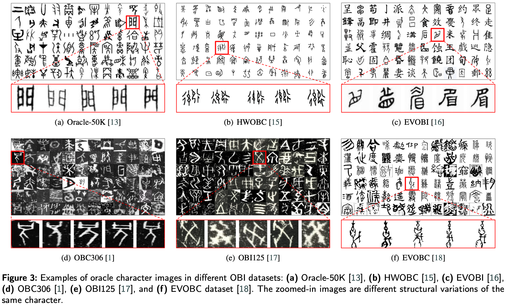
</div>
</details>

## Quantitative and Qualitative Comparisons 📊

<details close>
<summary>Quantitative results on Oracle-50K and NCIB datasets (click to expand)</summary>
<div style="width: 100%; text-align: center; margin:auto;">
      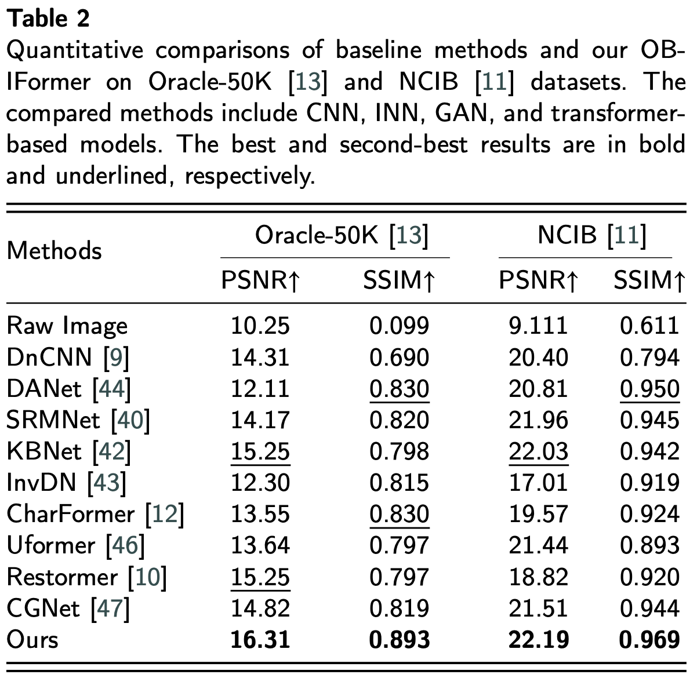
</div>
</details>

<details close>
<summary>Qualitative results on Oracle-50K dataset (click to expand)</summary>
<div style="width: 100%; text-align: center; margin:auto;">
      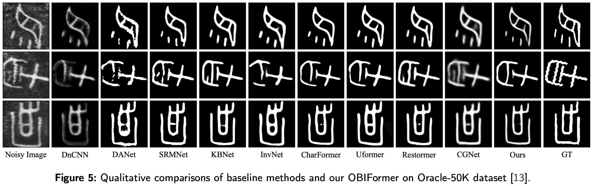
</div>
</details>

<details close>
<summary>Qualitative results on NCIB dataset (click to expand)</summary>
<div style="width: 100%; text-align: center; margin:auto;">
      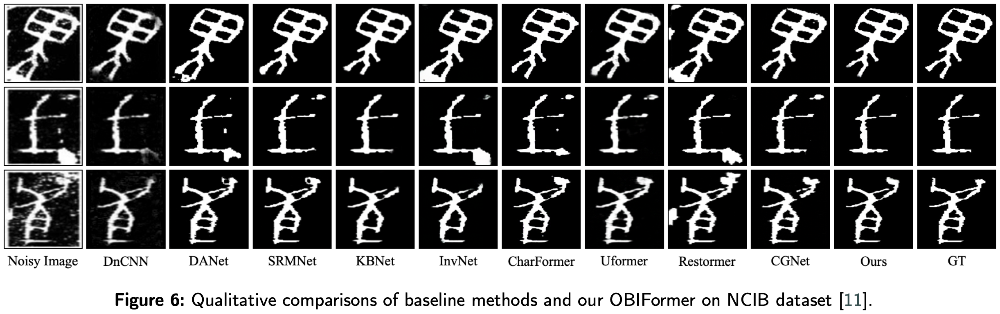
</div>
</details>

## Recognition Results 👁️

To further validate the effectiveness of OBI denoising in improving recognition accuracy, we employed ResNet-18,ResNet-50,and ResNet-152 for the OBI recognition task on the test set of the Oracle-50K dataset.

<div style="width: 100%; text-align: center; margin:auto;">
      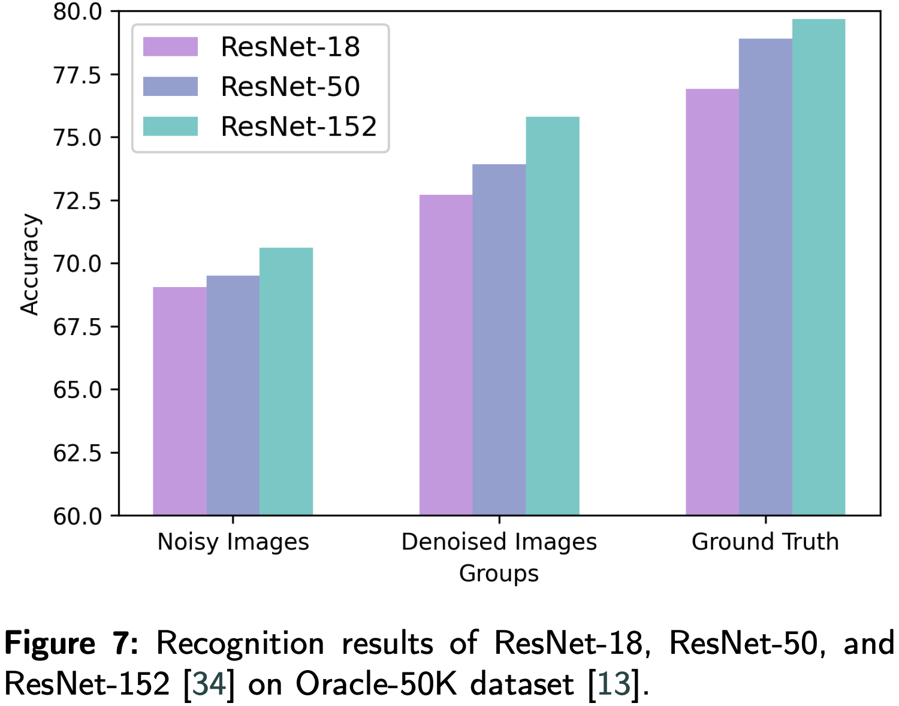
</div>

## Computational Efficiency ⏱️

We evaluate the number of parameters (#Param.), FLOPs, and infer time of different OBI denoising methods.

<div style="width: 100%; text-align: center; margin:auto;">
      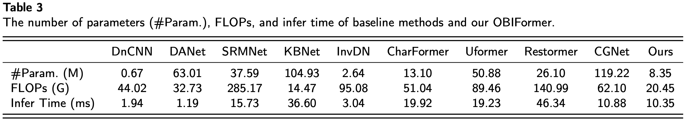
</div>

## Generalization Ability 🦾

To explore the generalization ability of our OBIFormer, we tested it on a real oracle dataset (i.e., the OBC306 dataset) after training it on Oracle-50K and NCIB datasets.

<details close>
<summary>Qualitative results on NCIB dataset (click to expand)</summary>
<div style="width: 100%; text-align: center; margin:auto;">
      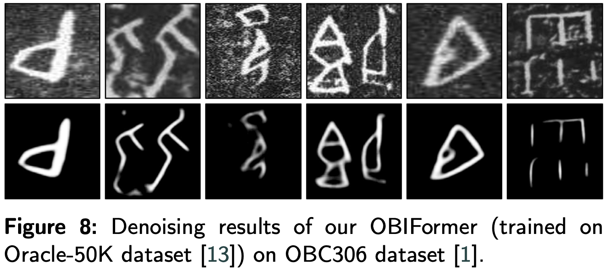
</div>
</details>

<details close>
<summary>Qualitative results on NCIB dataset (click to expand)</summary>
<div style="width: 100%; text-align: center; margin:auto;">
      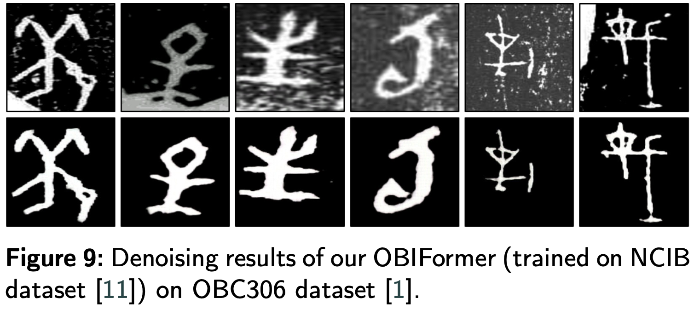
</div>
</details>

## Visualizations 🖼️

We visualize the deep features extracted by the last OFB, which consists of reconstruction and glyph features.

<div style="width: 100%; text-align: center; margin:auto;">
      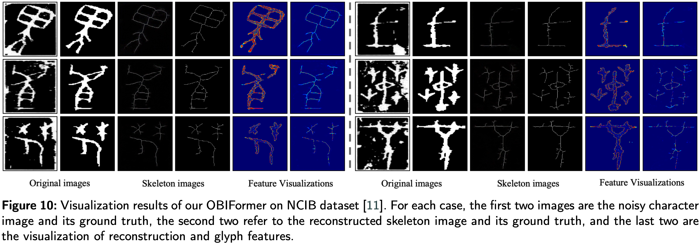
</div>

## Contact ✉️

Please contact the first author of this paper for queries.

- Jinhao Li, `lomljhoax@stu.ecnu.edu.cn`

## Citation 📎

If you find our work interesting, please feel free to cite our paper:
```
@misc{li2025obiformerfastattentivedenoising,
      title={OBIFormer: A Fast Attentive Denoising Framework for Oracle Bone Inscriptions}, 
      author={Jinhao Li and Zijian Chen and Tingzhu Chen and Zhiji Liu and Changbo Wang},
      year={2025},
      eprint={2504.13524},
      archivePrefix={arXiv},
      primaryClass={cs.CV},
      url={https://arxiv.org/abs/2504.13524}, 
}
```

## <a name="acknowledgements"></a> Acknowledgements 🏆

This work was supported by the National Social Science Foundation of China (24Z300404220) and the Shanghai Philosophy and Social Science Planning Project (2023BYY003).
